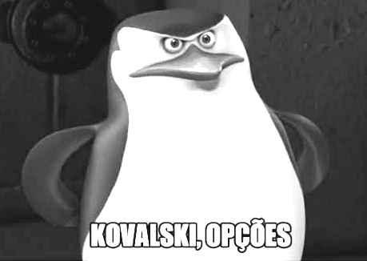

## Introdução

Este projeto tem como objetivo desenvolver um plano amostral criativo para estimar a área total verde e a biomassa vegetal do campus universitário. A atividade visa proporcionar experiência prática de amostragem complexa em um contexto real e estimulante, utilizando apenas recursos simples, como o próprio celular e  computadores  do laboratório do departamento.

Vocês terão aproximadamente um mês para elaborar, executar e relatar o projeto.

## Objetivos Específicos

- Desenvolver um plano amostral criativo e prático utilizando recursos básicos disponíveis.
- Estimar quantitativamente a área verde e a biomassa vegetal do campus.
- Aplicar técnicas estatísticas adequadas e acessíveis para análise dos resultados.
- Discutir criticamente os resultados obtidos.

## Instruções Gerais

- Grupos: máximo de **3 alunos**.
- Entrega: relatório detalhado.
- O relatório deverá conter introdução, metodologia, resultados, discussão e conclusão. Além de códigos para efeito de reprodutibilidade

### Plano Amostral Proposto

Nesta seção, apresentem detalhadamente o plano amostral e metodologia a ser desenvolvida, incluindo:

- Definição clara da área verde total do campus como população-alvo.
- Definição das unidades amostrais (ex.: parcelas quadradas ou circulares pequenas, pontos aleatórios marcados diretamente com aplicativos de celular), etc.
- Escolha e descrição detalhada da técnica de amostragem: amostragem estratificada (ex.: tipos de vegetação), amostragem sistemática (intervalos fixos), ou conglomerados (áreas subdivididas).
- Justificativa clara para escolha do método baseada em acessibilidade, praticidade e precisão.

### Sugestões práticas de coleta usando celular:

- Uso de aplicativos gratuitos (Google Maps, GPS Essentials, QField, entre outros) para localização precisa das parcelas.
- Fotos tiradas com celular para registrar cada parcela e auxiliar nas medições.
- Medições simples (ex.: passos calibrados, fitas métricas caseiras) para áreas pequenas.


### Coleta de Dados

Nesta seção detalhem:

- Como definiram precisamente as parcelas utilizando apenas o celular.
- Método de coleta simplificado da biomassa: altura média estimada das plantas, contagem visual de plantas, estimativa visual da cobertura.
- Registro fotográfico obrigatório para validação visual.
- Relato das dificuldades encontradas e como foram superadas com criatividade.


### Metodologia Estatística

Especifiquem claramente:

- Escolha e descrição de um estimador (ex.: Horvitz-Thompson, Hansen-Hurwitz).
- Justificativa técnica acessível e clara para a escolha do estimador.
- Cálculo simples e direto dos pesos amostrais.
- Avaliação da consistência e qualidade dos dados coletados.

### Resultados

Apresentem claramente:

- Tabelas e gráficos simples das estimativas obtidas com intervalos de confiança.
- Gráficos exploratórios (boxplot, histogramas, mapas simples feitos com aplicativos móveis).


### Discussão

Nesta seção discutam:

- Vantagens e limitações encontradas ao usar métodos simples e acessíveis.
- Confiabilidade prática dos resultados obtidos.
- Sugestões criativas para aprimorar a metodologia em estudos futuros.


### Conclusão

Sintetizem os principais resultados, destacando:

- Importância prática do projeto para compreensão das técnicas de amostragem.
- Habilidades práticas adquiridas com a execução do projeto usando recursos mínimos e acessíveis.


### Referências

Citem livros, artigos científicos ou relatórios técnicos consultados durante o desenvolvimento do projeto.

<br>


<br>
**Boa sorte e sejam criativos na exploração deste desafio prático!**
<br>


```{r, echo=FALSE, out.width="30%", fig.cap=""}

```
